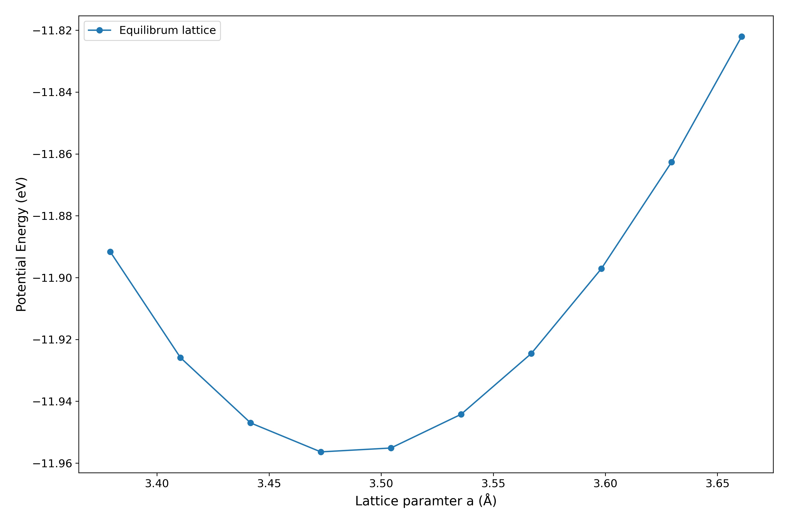

# Allegro-FM: uMLIP Electronic Structure and Fine Tuning

**A materials simulation framework for benchmarking and fine-tuning of Foundation Models for Interatomic Potentials (Allegro-FM, UMA, MACE, PET-MAD).**

## 1. Project Abstract 
### **$\color{cyan}{\text{What we are working on?}}$**

Universal Machine Learning Interatomic Potentials (**uMLIPs**) have fundamentally changed the evolution of computational materials science. It has the feature of both *ab initio* accuracy from traditional method like Density Functional Theory (**DFT**) and the efficiency required for large scale Molecular Dynamics (**MD**). 

Foundation Models(FMs) like **MACE-MP-0** and **Allegro-FM** are universal, pre-trained potentials capable of providing reliable, out-of-the-box predictions across the preodic table.
   - This project aims to use foundation model for materials research and molecular dynamics simulations.
   - We aims at exploring [Allegro-FM](https://arxiv.org/abs/2502.06073), [Meta Uma universal model](https://ai.meta.com/research/publications/uma-a-family-of-universal-models-for-atoms/), [MACE model](https://github.com/ACEsuit/mace-foundations) and [PET-MAD model](https://github.com/lab-cosmo/pet-mad) to benchmark properties of different materials.

The practical utility of an uMLIP depends on how efficiently the model can be specialized for a target system. We propose that the PET architecture combined with parameter-efficient Low-Rank Adaptation (**LoRA**) enables rapid fine-tuning to near-quantum accuracy. In this work, we will first rigorously benchmark accuracy-efficiency trade-offs among representative foundation models and traditional DFT calculations.

### **$\color{cyan}{\text{Why we need?}}$**

- Specialization: Fine-tuning allows us to take a more general model and optimize it for a specific system.
  For example:
  - **Thermodynamic Systems :** Recovering the exact energy minima required for Ni-based superalloy stability and phase boundaries.
  - **Disordered Systems :** Capturing the complex geometries of semi-amorphous Calcium-Silicate-Hydrate (Tobermorite).

- Achieving Near-Quantum Accuracy: While universal models are good, but they may not match the precision of *ab initio* methods for every structure. The project proposes using techniques like LoRA to rapidly fine-tune the model to achieve "near-quantum accuracy" relative to DFT data.

- Handling Complex Phenomena: Universal models might struggle with very specific or complex structural nuances. Fine-tuning is used here to accurately simulate delicate phenomena like defect formation energies, adsorption sites, and grain boundary effects (such as stacking fault energy), which require precise energy and force calculations that a general model might glaze over.

Essentially, fine-tuning bridges the gap between the efficiency required for large scale MD and the high accuracy needed for valid material property characterization.

## 2. Project goal 
### **$\color{cyan}{\text{What is the goal?}}$**

1. **Characterization:** Design and characterize Ni FCC structures and Ni-based alloy systems, analyzing the effects of Ni percentage on structural stability.

2. **Benchmarking:** Validate model predictions (Allegro-FM, UMA, MACE, PET-MAD) against Density Functional Theory (DFT) data for both alloys and complex Tobermorite structures.

3. **Property Analysis:** Calculate and compare fundamental properties via the kn kernel:
   - Lattice parameters and structures
   - Radial Distribution Functions (RDF) and bond/angle Distributions
   - Elastic constants
   - Phonon properties
   - etc.

4. **Large-Scale Simulation:** Simulate phenomena at a larger scale, such as defect formation energies and favorable adsorption sites, using the fine-tuned potentials.
     
## 3. Methodology 
### **$\color{cyan}{\text{What we are using and What's special?}}$**

   - Allegro-FM integration with [Atomic Simulation Environment](https://nequip.readthedocs.io/en/latest/integrations/ase.html): Use ASE package to build the FCC Ni structure and Ni-based alloy systems.
   - Data Preparation for Fine-Tuning: Gather dataset of Ni structures and their corresponding energies and forces to use for fine-tuning.
   - Model Fine-tuning: Load pre-trained Allegro-FM with 89 elements, then fine-tune the model using the prepared Ni-based alloy dataset to optimize for this particular material.
   - MD runs: Run [large-scale molecular dynamics simulations](https://www.lammps.org/#gsc.tab=0). Also simulate the effects of grain boudany, such as changes in lattice structure or stacking fault energy.
   - Result Analysis: Use ASE tools for preliminary analysis, then use tools like [phonopy](https://phonopy.github.io/phonopy/phonopy-module.html) or [mdapy](https://mdapy.readthedocs.io/en/latest/) for validation and characterization purpose. 

## 4. Preliminary results
- Lattice parameter prediction with MACE and UMA models for Ni FCC unit structure
<table>
  <tr>
    <td align="center">
      
       
      <em>MACE Model Prediction</em>
    </td>
    <td align="center">
      
       
      <em>UMA Model Prediction</em>
    </td>
  </tr>
</table>

- Potentoal energy variation with volume predicion with Nequip model for Ni FCC unit structure

- Lattice parameter prediction with MACE and UMA models for Tobermorite structure
