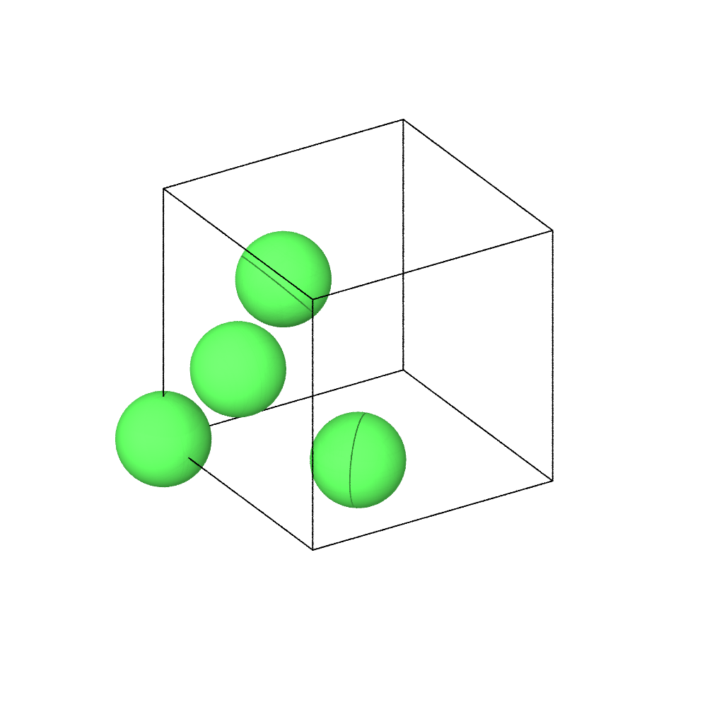
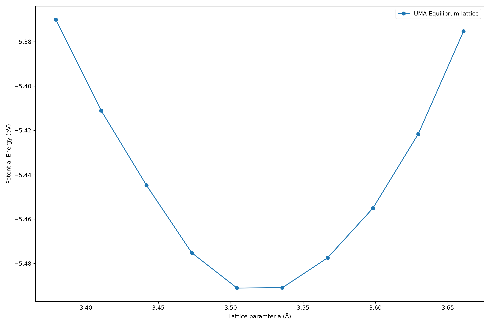

# Allegro-FM: uMLIP Electronic Structure and Fine Tuning


**A materials simulation framework for benchmarking and fine-tuning of Foundation Models for Interatomic Potentials (Allegro-FM, UMA, MACE, PET-MAD).**


## 1. Project Abstract 
### **$\color{red}{\text{What we are working on?}}$**

Universal Machine Learning Interatomic Potentials (**uMLIPs**) have fundamentally changed the evolution of computational materials science. It has the feature of both *ab initio* accuracy from traditional method like Density Functional Theory (**DFT**) and the efficiency required for large scale Molecular Dynamics (**MD**). 

Foundation Models(FMs) like **MACE-MP-0** and **Allegro-FM** are universal, pre-trained potentials capable of providing reliable, out-of-the-box predictions across the preodic table.
   - This project aims to use foundation model for materials research and molecular dynamics simulations.
   - We aims at exploring [Allegro-FM](https://arxiv.org/abs/2502.06073), [Meta Uma universal model](https://ai.meta.com/research/publications/uma-a-family-of-universal-models-for-atoms/), [MACE model](https://github.com/ACEsuit/mace-foundations) and [PET-MAD model](https://github.com/lab-cosmo/pet-mad) to benchmark properties of different materials.

The practical utility of an uMLIP depends on how efficiently the model can be specialized for a target system. We propose that the [PET](https://arxiv.org/abs/2305.19302) architecture combined with parameter-efficient [Low-Rank Adaptation (**LoRA**)](https://arxiv.org/abs/2106.09685) enables rapid fine-tuning to near-quantum accuracy. In this work, we will first rigorously benchmark accuracy-efficiency trade-offs among representative foundation models and traditional DFT calculations.

### **$\color{red}{\text{Why we need?}}$**
- Specialization: Fine-tuning allows us to take a more general model and optimize it for a specific system.
  For example:
  - **Bulk Materials:** Understanding of complex structure of multiferroic materials, like Hexagonal Manganite YMnO3.
    <p align="center">
      
    </p>
  - **Thermodynamic Systems:** Recovering the exact energy minima required for Ni-based superalloy stability and phase boundaries.
    <p align="center">
      
    </p>
  - **Disordered Systems:** Capturing the complex geometries of semi-amorphous Calcium-Silicate-Hydrate (Tobermorite).
    <p align="center">
      
    </p>
     
- Achieving Near-Quantum Accuracy: While universal models are good, but they may not match the precision of *ab initio* methods for every structure. The project proposes using techniques like LoRA to rapidly fine-tune the model to achieve "near-quantum accuracy" relative to DFT data.

- Handling Complex Phenomena: Universal models might struggle with very specific or complex structural nuances. Fine-tuning is used here to accurately simulate delicate phenomena like defect formation energies, adsorption sites, and grain boundary effects (such as stacking fault energy), which require precise energy and force calculations that a general model might glaze over.

Essentially, fine-tuning bridges the gap between the efficiency required for large scale MD and the high accuracy needed for valid material property characterization.

## 2. Project goal 
### **$\color{red}{\text{What is the goal?}}$**

1. **Characterization:** Characterize Ni FCC structures and Ni-based alloy systems, analyzing the effects of Ni percentage on structural stability.

2. **Benchmarking:** Validate model predictions (Allegro-FM, UMA, MACE, PET-MAD) against Density Functional Theory (DFT) data for both alloys and bulk materials with complex structure.

3. **Property Analysis:** Calculate and compare fundamental properties:
   - Lattice parameters and structures
   - Radial Distribution Functions (RDF) and bond/angle Distributions
   - Elastic constants
   - Phonon properties
   - etc.

4. **Large-Scale Simulation:** Simulate phenomena at a larger scale, such as defect formation energies and favorable adsorption sites, using the fine-tuned potentials.
     
## 3. Methodology 
### **$\color{red}{\text{What we are using and What's special?}}$**

   - Use ASE and Fairchem for python API.
   - Data Preparation for Fine-Tuning: Gather training/validation/test dataset and their corresponding energies and forces to use for fine-tuning from DFT(VASP) in this case.
   - Model Fine-tuning: Load pre-trained models, then fine-tune the model using the prepared dataset to optimize for this particular material.
   - MD runs: Run [large-scale molecular dynamics simulations](https://www.lammps.org/#gsc.tab=0). For Ni and metal alloys, also simulate the effects of grain boudany, such as changes in lattice structure or stacking fault energy.
   - Result Analysis: Complete the Property Analysis.

## 4. Repository Architecture

```
Allegro-FM-application-for-materials-property/
├── data/             # input  raw datasets 
├── result/           # output plots
├── src/              # source code used in different models and test Finetune
│ ├── MACE-test/  
│ ├── UMA-test/ 
│ ├── Nequip-test/
│ ├── Finetune/
├── CITATION.cff      # citation metadata
├── LICENSE           # MIT License
├── requirements.txt  # python dependencies
└── README.md         # project documentation
```
(Important message: The finetune script here is CPU-only version with smaller dataset and batch size for TEST PURPOSE ONLY!)

## 5. Preliminary results

### Base Model test for MACE, UMA and Nequip for Ni FCC unit structure
- Lattice parameter prediction with MACE and UMA models for Ni FCC unit structure
<table>
  <tr>
    <td align="center">
      
      <br>
      <em>MACE Model Prediction</em>
    </td>
    <td align="center">
      
      <br>
      <em>UMA Model Prediction</em>
    </td>
  </tr>
</table>

- Potential energy variation with volume predicion with Nequip model for Ni FCC unit structure
    <p align="center">
      
    </p>

### G(r) calculation, MD performance, and structure optimization using UMA for Tobermorite
<table>
  <tr>
    <td align="center">
      
      <br>
      <em>G(r)</em>
    </td>
    <td align="center">
      
      <br>
      <em>MD performance</em>
    </td>
  </tr>
</table>

https://github.com/user-attachments/assets/a25de54a-6c89-42fa-9da4-0a1371a890e7


### Finetune preliminary study

- 100 training samples, 20 validation from vasprun.xml from VASP non-collinear simulation on YMno3 2x2x1 120 atoms structure. (NOTE: Preliminary study runs on CPU with smaller dataset for now)
- Using weight decaying AdamW optimizer in this example.

| Metric | Base UMA | Fine-tuned UMA | DFT Ground Truth |
| :--- | :--- | :--- | :--- |
| **Energy (eV)** | -1001.7435 | -1070.8307 | -1061.56 |

<table>
  <tr>
    <td align="center">
      
      <br>
      <em>Predicted Energy</em>
    </td>
    <td align="center">
      
      <br>
      <em>Drift of Energy from Initial</em>
    </td>
  </tr>
</table>

<table>
  <tr>
    <td align="center">
      
      <br>
      <em>Temperture of the system</em>
    </td>
    <td align="center">
      
      <br>
      <em>RDF for Y-O and Mn-O</em>
    </td>
  </tr>
</table>

## 6. Working Plan
- Approved by Director's Discretionary Allocation Award from ALCF for computing time and moving to GPU.
- LoRA adaptation: inserts adapter modules, replaces Linear layers, freezes base parameters, and restricts the optimizer to adapter parameters
  [LoRA](https://arxiv.org/abs/2106.09685)/[QLoRA](https://arxiv.org/abs/2305.14314) fine tuning methods.
- Unconstrained Model of PET-MAD.


